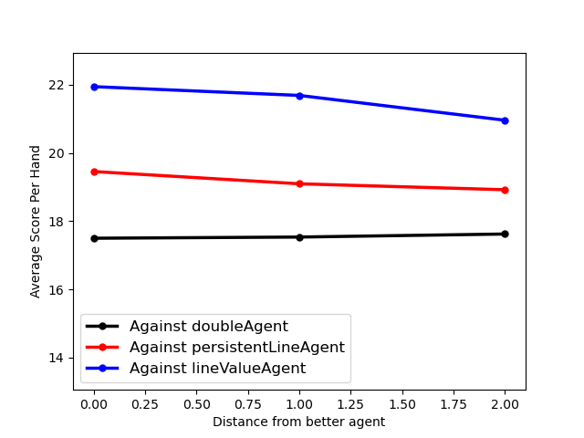

# Documentation: Basic Analysis

This section of the documentation shows the results of some basic analyses 
(usually performed with scripts in the [experiments](../experiments) 
directory). These analyses are meant to serve two general purposes: 
1. Give any readers a sense for some basic features of dominoes games
2. Analyze statistical properties of dominoes
   - in particular, I'm curious to know about game statistics, and I can't ask
     my family to be a part of a statistics experiment in good conscience...

## Does Table Position Matter? 

