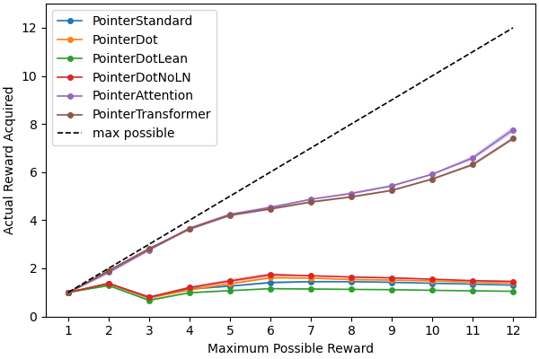

# Documentation: Line Sequencer with Pointer Networks

Finally, the dominoes line sequencer task. This task is the reason I began 
using pointer networks to begin with. The dominoes line sequencer task is a 
complicated version of the traveling salesman problem. The task goes as 
follows. An agent receives a set of dominoes and has to play the longest 
possible sequence of dominoes it can following the (somewhat complicated) 
rules of which dominoes are permitted to follow each other. 

## The Task
As I explained in the [toy problem](./pointerDemonstration.md), a full dominoe
set is the every possible combination with replacement of two values from 0 to
a number, defined as the highest dominoe. Typically, the highest dominoe value
is `9` or `12`, but for an example I'll use `highestDominoe=4`. Below is a 
representation of 6 dominoes from the set, including both their values and the
way dominoes are represented to the network (see the toy problem for more
explanation). Note: unlike the toy problem, in this task `(0 | 1)` is the same
dominoes as `(1 | 0)`, so each dominoe can only be represented in one 
direction.

`(0 | 0)`

`(0 | 1)`

`(0 | 2)`

`(0 | 3)`

`(2 | 1)`

`(0 | 4)`

At the beginning, the agent receives a contextual input telling it what value 
is currently "available". Suppose for the above hand, the "available" number
is `3`. Then, the following is a possible sequence:

From `3`: `(3 | 0)` - `(0 | 0)` - `(0 | 1)` - `(1 | 2)` - `(2 | 0)` - `(0 | 4)`

Great! For that hand, if an agent plays the dominoes in the optimal order, it
can play all the domiones. That's the goal. Suppose the agent played: 

From `3`: `(3 | 0)` - `(0 | 4)` ... after playing `(0 | 4)`, the value 4 is
"available", but since no other dominoe has a 4 on it, then the agent can't 
keep playing so is stuck with the remaining dominoes in its hand.

In addition to the dominoes, the agent also receives a "null token" it can
play to indicate that there are no more valid moves. For example, the agent
should play the null token after the `(0 | 4)` in both examples above. 

## Comparison to the Traveling Salesman Problem
This task has some similarities to the traveling salesman problem in the sense
that the agent has to find a path through the dominoes. However, there are a
few differences that make it a bit more complicated. 

1. The connection graph is not complete. In other words, if each dominoe is a
node, not all edges between dominoes exist. Only edges between dominoes 
containing the same value exist (and the edge length is always equal).
2. The path towards a certain dominoe (i.e. node) determines the valid paths 
away from that dominoe. For example, playing the `(0 | 4)` dominoe after 
playing the `(3 | 0)` dominoe means that the "open" value is a `4`. This means
that dominoes with a `4` are valid next steps, but dominoes with a `0` are not
- even though the last dominoe played (`(0 | 4)`) has a `0` in it. 
3. It is not always possible to visit every dominoe (i.e. node), so the agent 
must determine which dominoes to visit and which to avoid to maximize value.

There's an additional difference. Whereas the goal of the traveling salesman
problem is to visit every city in as little distance as possible, the goal of 
dominoe sequencing (in a real game) is to minimize the number of points left
in your hand at the end of the game. The tricky bit is that other players are 
trying to end the game as fast as they can, so an agent doesn't necessarily 
know how much time is left. This means that in the full dominoes sequencing 
problem, the agent has two additional considerations to make:

4. The agent should "play dominoes" (i.e. visit nodes) with a higher value as
soon as possible, and leave dominoes that have a smaller value to be visited 
layer in the sequence, or not at all if impossible. 
5. The agent should vary their strategy based on the expected "time left", in 
the sense that a choice between playing a longer line with more total value
(which takes more time) and playing a shorter line that dumps value quickly 
will depend on the agents estimation of how much time is left in the game. 
This is essentially a dynamic discounting problem. 

## First steps
To begin with, I trained pointer networks using all the different 
architectures I introduced in [this](./pointerArchitectureComparison.md) 
documentation file with the REINFORCE algorithm. The initial task didn't value
dominoes differently - each dominoe has a reward of `1`, so the goal is simply
to play as many dominoes as possible in a valid sequence. This is a pared down
version of the full problem most relevant for actual dominoes agents, but is a
useful starting point for exploring how the different architectures perform.

The reward function is simple:
- Every valid dominoe play has a reward of `1`.
- Every invalid dominoe play (ones that don't connect to the last available 
value), has a reward of `-1`.
- Every valid null token has a reward of `1`. (Null tokens are valid when 
there are no more valid dominoes to play).
- Every invalid null token has a reward of `-1`. (Null tokens are invalid if 
they are played when there was a valid dominoe that could be played).

After any invalid choice, the rewards are all `0` because the line has ended.

### Results
The results of training these networks are here. The first plot shows the 
average cumulative reward for each hand. The agents receive 12 random dominoes
per hand, so the maximum possible reward is 12. However, some hands have a 
smaller maximum reward because there is no valid path through all dominoes in
the graph. The curves show the mean +/- standard deviation of 8 networks 
trained with each architecture.

These results are awesome! They show that the networks start out very 
confused and eventually have a moment of insight where they start sequencing
dominoes correctly. Each network instance has the moment of insight at a 
different time -- this is easiest to see for the pointer "transformer" 
network. 

Consistent with my earlier results on the toy problem and the traveling 
salesman problem, the pointer "dot" based architectures do best on this task
because I'm training them with reinforcement learning. As before, the "dot"
architectures learn fastest and end with the highest average cumulative reward
(although the other networks haven't asymptoted yet). Interestingly, whereas
all architectures were able to learn the other tasks, the standard pointer 
layer networks appear to completely fail to learn the task, getting stuck with
less than 1 total average reward per hand. 

As a way to measure the networks performance relative to optimal performance
on this task, I compared their average reward with the maximum possible reward
for each set of dominoes (or "hand" as I've called it) evaluated with a brute
force algorithm. I only measured this during the testing phase. 

Analysis of performance at testing phase:

The black dashed line indicates the maximum possible reward, and the colored
lines indicate the actual (average) reward accumulated by each network. As the
maximum possible reward increases, the networks gradually accumulate more and 
more reward themselves. They don't achieve optimal reward, but are pretty 
close. All architectures achieve similar performance at the end of 12000 
training epochs, except for the standard pointer layer. 

## The standard pointer layer confuses the gradient backpropagation
Next, I wanted to understand why the networks equipped with the standard 
pointer layer fail to learn the task. Since the networks are divided into 
three main modules, the (1) encoder, the (2) context update layer, and the
(3) pointer layer, I thought that breaking the networks down into their 
consistuents might reveal where the standard pointer layer networks went 
wrong. For details on the three modules, see 
[this](./pointerDemonstration.md).

As a first step, I did a bidirectional "swap" experiment. I retrained pointer
layers using fixed, pretrained weights in the encoder and the context update 
layer. I did two experiments, both explained below.

### Can the standard pointer layer learn with a functional encoder? 
I used pretrained encoder & context update weights from networks trained with
each of the 6 possible pointer layer architectures, but replaced the original
pointer layer with the standard pointer layer. Only the weights of the 
standard pointer layer were subject to gradient updates.

This plot shows the training performance (in terms of average reward per hand)
for the standard pointer layer learning off of encoders trained with the other
pointer layer architectures. The label indicates which pointer layer type was
used to train the encoder. 

Wow! This is wild! Networks equipped with the standard pointer layer can learn
the sequencing task just as well as other networks, but _only if their encoder
module is pretrained with a different pointer layer_. The performance boost of
pretraining is most exaggerated for encoders pretrained with the pointer "dot"
layers, but this could also be because they learn fastest so have the most 
amount of training time to crystallize their "understanding" of the task. And,
as a sanity check, networks with reinitialized standard pointer layers (blue)
still never learn - indicating that this result isn't just due to resetting 
the pointer layers weights. 

As above, this is a summary plot showing performance compared to best possible
performance for each hand, evaluated using a brute force algorithm during the
testing phase. It shows that standard pointer layers achieve comparable 
performance to networks trained with other pointer layers, but only if they 
have a functional, pretrained encoder. 

### Can the new pointer layers learn with an encoder trained by the standard pointer layer? 
In a reverse experiment as above, I used pretrained encoder & context update 
weights from networks trained with the standard pointer layer, but replaced 
the pointer layer with each of the 6 possible pointer layer architectures. 
Only the weights of the new pointer layers were subject to gradient updates. 

This is interesting too! The pointer "attention" and "transformer" layers can
learn to solve the task with an encoder pretrained using the standard pointer
layer, albeit not as well as other networks. This indicates that the standard
pointer layer encoders have enough information to solve the task somewhat well
but not enough to solve the task as good as possible. 

The most interesting result is that although the encoders trained with 
standard pointer layers have enough information to solve the task, that 
information is not structured in a way that is useful to the standard pointer
layer, _even though it was trained with the standard pointer layer_. 

As an additional result, the "dot"-based pointer architectures fail to solve
the task using encoders trained with the standard pointer layer. I believe the
reason the attention based layers (both the "attention" and "transformer" 
pointer layers) succeed where the "dot" based layers fail is because the 
attention layers compare the information in each possible output before 
choosing, which is not true of any other pointer layer. 

This result shows the stunted performance of event the "attention" and 
"transformer" pointer layers when equipped with an encoder pretrained using
the standard pointer layer.

## Next Steps
Coming soon:
- More unpacking of the bidirectional swap experiment described above. 
- Test of sequencing where a parallel network has to predict the total reward
accumulated for each hand using the same encoder as the pointer network -- 
this is going to be useful for when I port these networks to a real dominoe
agent. 
- Test of sequencing where the networks receive an additional context input 
that informs them of how much "time" is left, after which no rewards are
possible. This will be randomly generated, but in the dominoes agent that can
actually play the game, this will be computed by the network as a separate 
module and fed to the pointer network. 
