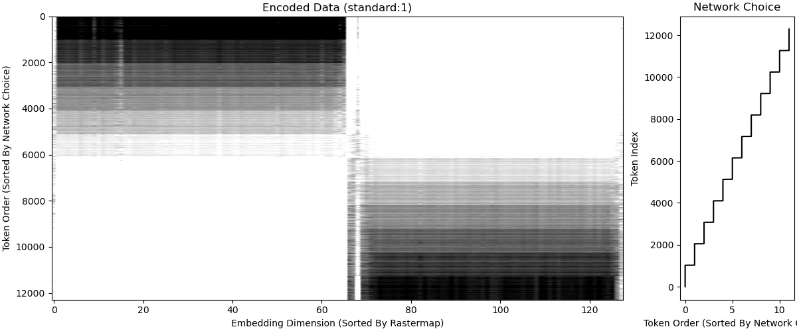
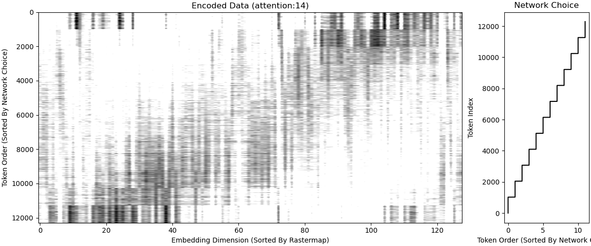

# Documentation: Line Sequencer with Pointer Networks

Finally, the dominoes line sequencer task. This task is the reason I began 
using pointer networks to begin with. The dominoes line sequencer task is a 
complicated version of the traveling salesman problem. The task goes as 
follows. An agent receives a set of dominoes and has to play the longest 
possible sequence of dominoes it can following the rules of which dominoes
are permitted to follow each other. 

## The Task
As I explained in the [toy problem](./pointerDemonstration.md), a full dominoe
set is every possible combination with replacement of two values from 0 to a
number, defined as the highest dominoe. Typically, the highest dominoe value
is `9` or `12`, but for an example I'll use `highestDominoe=4`. Below is a 
representation of 6 dominoes from the set, including both their values and the
way dominoes are represented to the network (see the toy problem for more
explanation). 

`(0 | 0)` : `[1, 0, 0, 0, 0, 1, 0, 0, 0, 0]`

`(0 | 1)` : `[1, 0, 0, 0, 0, 0, 1, 0, 0, 0]`

`(0 | 2)` : `[1, 0, 0, 0, 0, 0, 0, 1, 0, 0]`

`(0 | 3)` : `[1, 0, 0, 0, 0, 0, 0, 0, 1, 0]`

`(2 | 1)` : `[0, 0, 1, 0, 0, 0, 1, 0, 0, 0]`

`(0 | 4)` : `[0, 0, 0, 0, 0, 1, 0, 0, 0, 1]`

At the beginning, the agent receives a contextual input telling it what value 
is currently "available". Suppose for the above hand, the "available" number
is `3`. Then, the following is a possible valid sequence:

From `3`: `(3 | 0)` - `(0 | 0)` - `(0 | 1)` - `(1 | 2)` - `(2 | 0)` - `(0 | 4)`

Great! For that hand, if an agent plays the dominoes in the optimal order, it
can play all the domiones. That's the goal. Suppose the agent played: 

From `3`: `(3 | 0)` - `(0 | 4)` ... after playing `(0 | 4)`, the value 4 is
"available", but since no other dominoe has a 4 on it, then the agent can't 
keep playing so is stuck with the remaining dominoes in its hand.

In addition to the dominoes, the agent also receives a "null token" it can
play to indicate that there are no more valid moves. For example, the agent
should play the null token after the `(0 | 4)` in both examples above. 

## Comparison to the Traveling Salesman Problem
This task has some similarities to the traveling salesman problem in the sense
that the agent has to find a path through the dominoes. However, there are a
few differences that make it a bit more complicated. 

1. The connection graph is not complete. In other words, if each dominoe is a
node, not all edges between dominoes exist. Only edges between dominoes 
containing the same value exist (and the edge value is always the same).
2. The path towards a certain dominoe (i.e. node) determines the valid paths 
away from that dominoe. For example, playing the `(0 | 4)` dominoe after 
playing the `(3 | 0)` dominoe means that the "open" value is a `4`. This means
that dominoes with a `4` are valid next steps, but dominoes with a `0` are not- 
even though the last dominoe played `(0 | 4)` has a `0` in it. 
3. It is not always possible to visit every dominoe (i.e. node), so the agent 
must determine which dominoes to visit and which to avoid to maximize value.

## First steps
To begin with, I trained pointer networks using all the different 
architectures I introduced in [this](./part1-demonstration.md) 
documentation file with the REINFORCE algorithm. The task doesn't value dominoes
differently - each dominoe has a reward of `1`, so the goal is simply to play as 
many dominoes as possible in a valid sequence. This is a pared down version of the 
full problem most relevant for actual dominoes agents, but is a useful starting point
for exploring how the different architectures perform.

The reward function is simple:
- Every valid dominoe play has a reward of `1`.
- Every invalid dominoe play (ones that don't connect to the last available 
value), has a reward of `-1`.
- Every valid null token has a reward of `1`. (Null tokens are valid when 
there are no more valid dominoes to play).
- Every invalid null token has a reward of `-1`. (Null tokens are invalid if 
they are played when there was a valid dominoe that could be played).

After any invalid choice, the rewards are all `0` because the line has ended.

### Results
The results of training these networks are here. The first plot shows the 
average cumulative reward for each hand. The agents receive 12 random dominoes
per hand, so the maximum possible reward is 12. However, some hands have a 
smaller maximum reward because there is no valid path through all dominoes in
the graph. The curves show the mean +/- standard deviation of 8 networks 
trained with each architecture.

These results are awesome! They show that the networks start out very 
confused and eventually have a moment of insight where they start sequencing
dominoes correctly. Each network instance has the moment of insight at a 
different time -- this is easiest to see for the pointer "transformer" 
network. 

Consistent with my earlier results on the toy problem and the traveling 
salesman problem, the pointer "dot" based architectures do best on this task
because I'm training them with reinforcement learning. As before, the "dot"
architectures learn fastest and end with the highest average cumulative reward
(although the other networks haven't asymptoted yet). Interestingly, whereas
all architectures were able to learn the other tasks, the standard pointer 
layer networks appear to completely fail to learn the task, getting stuck with
less than 1 total average reward per hand. 

As a way to measure the networks performance relative to optimal performance
on this task, I compared their average reward with the maximum possible reward
for each set of dominoes (or "hand" as I've called it) evaluated with a brute
force algorithm. I only measured this during the testing phase. 

Analysis of performance at testing phase:

The black dashed line indicates the maximum possible reward, and the colored
lines indicate the actual (average) reward accumulated by each network. As the
maximum possible reward increases, the networks gradually accumulate more and 
more reward themselves. They don't achieve optimal reward, but are pretty 
close. All architectures achieve similar performance at the end of 12000 
training epochs, except for the standard pointer layer. 

## The standard pointer layer prevents learning
Next, I wanted to understand why the networks equipped with the standard 
pointer layer fail to learn the task. Since the networks are divided into 
three main modules, the (1) encoder, the (2) context update layer, and the
(3) pointer layer, I thought that breaking the networks down into their 
consistuents might reveal where the standard pointer layer networks went 
wrong. For details on the three modules, see 
[this](./part1-demonstration.md).

### Can the standard pointer layer learn with a functional encoder? 
I used pretrained encoder & context update weights from networks trained with
each of the 6 possible pointer layer architectures, but replaced the original
pointer layer with the standard pointer layer. Only the weights of the 
standard pointer layer were subject to gradient updates.

This plot shows the training performance (in terms of average reward per hand)
for the standard pointer layer learning off of encoders that are pretrained with
the other pointer layer architectures. The label indicates which pointer layer
type was used to train the encoder. 

Wow! This is wild! Networks equipped with the standard pointer layer can learn
the sequencing task just as well as other networks, but _only if their encoder
module is pretrained with a different pointer layer_. The performance boost of
pretraining is most exaggerated for encoders pretrained with the pointer "dot"
layers, but this could also be because they learn fastest so have the most 
amount of training time to crystallize their "understanding" of the task. And,
as a sanity check, networks with reinitialized standard pointer layers (blue)
still never learn - indicating that this result isn't just due to resetting 
the pointer layers weights. 

As above, this is a summary plot showing performance compared to best possible
performance for each hand, evaluated using a brute force algorithm during the
testing phase. It shows that standard pointer layers achieve comparable 
performance to networks trained with other pointer layers, but only if they 
have a functional, pretrained encoder. 

### Can the new pointer layers learn with an encoder trained by the standard pointer layer? 
In a reverse experiment as above, I used pretrained encoder & context update 
weights from networks trained with the standard pointer layer, but replaced 
the pointer layer with each of the 6 possible pointer layer architectures. 
Only the weights of the new pointer layers were subject to gradient updates. 

This is interesting too! The pointer "attention" and "transformer" layers can
learn to solve the task with an encoder pretrained using the standard pointer
layer, albeit not as well as other networks. This indicates that the standard
pointer layer encoders have enough information to solve the task, but it isn't
structured in a way that is useful to the standard pointer layer... _even though_
_it was trained with the standard pointer layer!_ 

This result also has an important implication for AI safety: it indicates that certain
abilities can lie dormant in neural networks and only be revealed when something
has changed downstream. Partially canging the architecture of the network is an
unusual thing to do, of course, but I can imagine something similar happening if
the context changes, for example.

As an additional result, the "dot"-based pointer architectures fail to solve
the task using encoders trained with the standard pointer layer. I believe the
reason the attention based layers (both the "attention" and "transformer" 
pointer layers) succeed where the "dot" based layers fail is because the 
attention layers compare the information in each possible output before 
choosing, which is not true of any other pointer layer. 

## How do networks trained with different pointer layers encode information? 
There's clearly something very different about the standard pointer layer. All
the other networks can learn the task, but ones with the pointer layer can't. Are
there any signatures of how standard pointer layers learn token representations
that can inform us why it's different? 

To answer this question, I returned to the dominoe sorting task, because it's a lot
more straightforward to analyze. To begin, I recovered the output of the pointer 
network encoder (see [part1](./part1-demonstration.md) to remember the architecture),
and plotted the average token embedding, sorted by the networks choice. I used an 
experimental neuroscience tool called [rastermap](https://github.com/MouseLand/rastermap)
to sort embedding dimensions so that they are clustered with similar dimensions.

For standard pointer layers, this is what we get: 

#### Standard Pointer Layer Average Encodings:

On the left is the average embedding with a colormap, and the right shows each embeding
dimensions activity across the tokens as a line plot. It's strange: it seems like networks
trained with standard pointer layers learn almost one-dimensional codes for sorting 
dominoes. How do other pointer layers learn encodings? 

#### Pointer "DotLean" Average Encodings:

#### Pointer "Attention" Average Encodings:

Interestingly, these two examples of different pointer network architectures learn codes that
are higher-dimensional and appear to smoothly traverse a space that has hints of translation 
invariance. I haven't yet applied these analyses to the more complicated dominoe sequencing 
problem, but I predict that these radical differences in coding mode have something to do with
why standard pointer layers fail to solve sequencing tasks. 

We can unpack the representations even further and plot all the representations in an entire 
batch (not just averaged across sort position). To facilitate viewing, I sorted all token 
representations in the batch by sort position and used the same embedding dimension sorting
as above (with rastermap). 

For the "standard" and "attention" pointers above, this is what that looks like:

#### Standard Pointer Layer All Token Encodings:

#### Attention Pointer Layer All Token Encodings:

Similar to the averages, it is readily visible that the tokens are encoded differently when 
learned with standard pointer layers vs. attention pointer layers. These are even more interesting
to look at because they show additional distinctions beyond what showed up in the average:
Whereas each group of tokens in the standard pointer layer are almost identical, regardless of batch,
the tokens encoded by attention-based pointer networks appear to have significant variation within
batch (there are 12 groups, each containing 1024 examples, see plot on right to see how they're grouped).

This indicates that pointer networks trained with standard pointer layers teach their encoders to 
use simple and inflexible codes, while networks trained with attention-based pointer layers appear
to exhibit much more flexibility. It is possible that some of this variability could be explained
by the particular set of dominoes selected for the batch-- that's something I'm working on figuring
out soon. 

