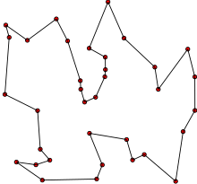
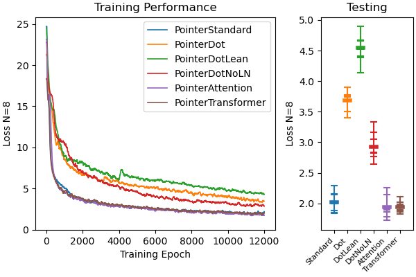
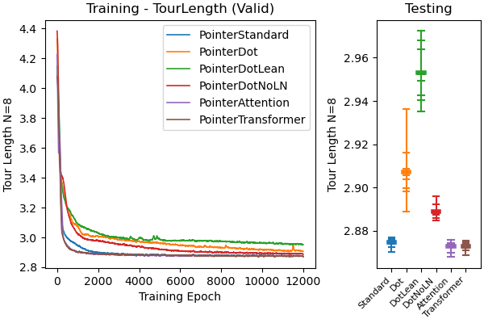
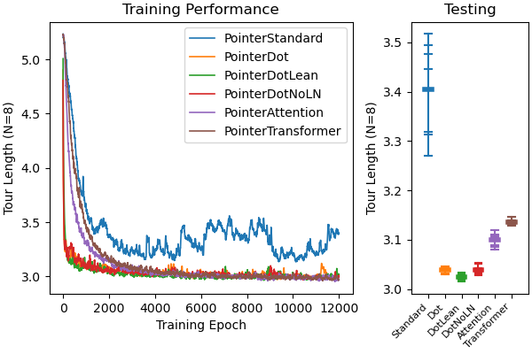
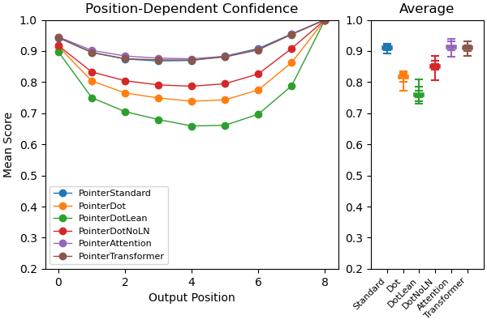
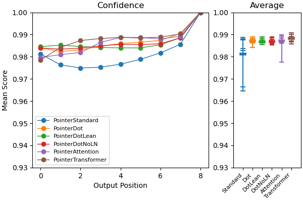

# Documentation: Traveling Salesman Problem

This documentation file shows how the new architectures for the pointer 
attention layer perform on the traveling salesman problem. I train the 
networks using both supervised learning and reinforcement learning (using the
REINFORCE algorithm). 

For more detail on the new architectures, go
[here](pointerArchitectureComparison.md).

To reproduce the plots in this file, you'll need to run two python scripts. I
train 8 networks for each architecture type to get a better readout of their
average performance on the task. The supervised learning script takes quite a
while to run (~2 hours for each round of networks, so ~16 hours total with the
default script parameters). This is primarily because the SL task requires the
optimal solution to the problem, which is exponential with the number of 
cities. I train with $N=10$ cities. To speed it up, change the arguments to
`--num-runs 1` and `--num-cities 8`, which is already considerably faster.
```
python experiments/ptrArchComp_TSP_SL.py --num-runs 8 --num-cities 10
```

The reinforcement learning version is much faster because no target needs to 
be computed. This takes ~30 minutes for each round of networks on my computer
with default parameters, or ~4 hours total.
```
python experiments/ptrArchComp_TSP_RL.py --num-runs 8 --num-cities 10
```

## The Traveling Salesman Problem
The traveling salesman problem is a well-defined, highly-studied problem in 
which the goal is to find the shortest path through a list of cities that 
takes you to each city. Here's a schematic of what that looks like from the 
[wiki](https://en.wikipedia.org/wiki/Travelling_salesman_problem):

<p align="center">
  
</p>

I chose this problem because it is often used to test the performance of 
pointer networks, including in the first paper to introduce them (Vinyals et
al.). Why? Primarily because pointer networks have the interesting and useful
feature of being able to generate a sequential output with a variable length
dictionary, where in this case the pointer network needs to generate a 
sequence from a variable number of cities. 

As in the original paper, I generated a list of N cities with coordinates 
inside the unit square $0 <= x,y < 1$. To make direct comparisons with the
paper, I trained the networks to solve the problem for $N=10$ cities, which
has an optimal "tour length" of 2.87.

#### Training with Supervised Learning 
To train networks on this problem with supervised learning, we need to define
the target. As in the original paper, I measured the optimal path with the 
held-karp algorithm using an existing python implementation (thanks to 
[Carl Ekerot](https://github.com/CarlEkerot/held-karp/blob/master/held-karp.py)).
Then, to keep the target consistent, I shifted and reversed the path as 
required such that the initial city was always the one closest to the origin, 
and such that the path traveled is always clockwise. The networks are required
to complete a full cycle in $N$ decoder steps, by traveling to every city and 
returning to the initial city.

#### Training with Reinforcement Learning
To train networks on this problem with reinforcement learning, we first need
to define a reward function. This problem has two challenges a network needs
to solve. First, it needs to travel to every city without revisiting any city.
Second, it needs to take the shortest possible path. These two features lead
to two independent reward functions. 

- I assign a reward of $1$ for every new city that is reached and a reward of
$-1$ for every revisited city. 
- For every step taken with euclidean distance traveled $d$, I assign a reward
of $-d$ (because REINFORCE performs gradient ascent, and the goal is to 
minimize distance traveled). Like in the supervised learning problem, I assume
that the initial city is the one closest to the origin, so the the first step 
taken by the network is evaluated based on the distance between it's chosen 
city and the initial city.


## Results
There are three natural methods of measuring the performance on the supervised
learning formulation of the problem. 

1. We can measure the loss (defined as the negative log-likelihood loss 
between the output and target). This is lowest when the network produces the 
optimal cycle of cities and is 100% confident in its choice.
2. The average tour length of completed tours. This measures the path length
through the $N$ cities (and back to the first) for the sets of cities that it 
performed a full tour. 

For the summary plots of the testing performance in the right panel, I show 
the average with a thick horizontal bar, the result for each network with a
thin horizontal bar, and the range with the vertical bar. 

### Supervised Learning Results
Here's the loss:



The loss of the networks with "attention" and "transformer" pointer layers are
comparable to the standard pointer layer, and the "dot" pointer layers are a
bit worse. In this context, it seems like the standard pointer layer is ideal
given the fact that it is commonly used and well understood. The performance
as measured by the loss is reflected in the average tour length of completed
tours:



The standard, attention, and transformer based pointer layers perform the task
optimally (ground-truth optimal performance is ~ $2.87$ ). Overall, this result 
is in agreement with the supervised learning results on the [toy problem](pointerArchitectureComparison.md#variations-in-learning-algorithm-supervised-learning).
Generally, the standard pointer layer has favorable performance in comparison
to the new pointer layers when trained with reinforcement learning. 

### Reinforcement Learning Results
For the reinforcement learning problem, we can measure the performance the 
same way, but without consideration of the loss (it's not defined since there
is no longer a "correct" way to solve the problem). 

Note that during training the networks choose with thompson sampling and a 
temperature of 5, so although the curves provide some information about the 
learning trajectory, it is much more informative to focus on the testing 
results. 

Here's the average tour length for completed tours:



In terms of both the fraction of completed tours and the valid tour length, 
the networks equipped with the Pointer "Dot" layer perform better on the task!
Although the "attention" and "transformer" based pointer layer networks appear
to have potential (some network instances do well, others not as well), this 
result is in agreement with the results from the dominoes 
[toy problem](pointerArchitectureComparison.md#network-performance), in which
the "Dot" based layers appear better poised to learn in the reinforcement
learning context. 

### Measuring the "confidence" of the networks
We can also measure how confident the networks are in the solution. As before,
I measure confidence as the maximum score assigned to a city at each position
in the output sequence, which is defined as the networks choice (it's a 
probability). 

For supervised learning, we have this: 



And for reinforcement learning, we have this:



As expected based on the dominoes 
[toy problem](pointerArchitectureComparison.md#network-confidence) and the 
intuition that a network with better performance will be more "confident", 
there is a close correspondence between the confidence of the networks trained 
with both SL and RL and their respective performance. 

