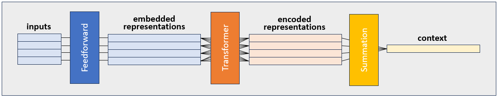
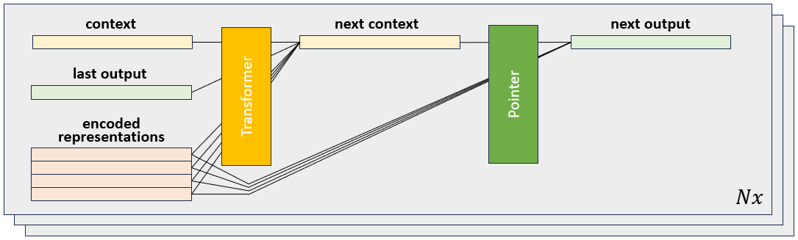
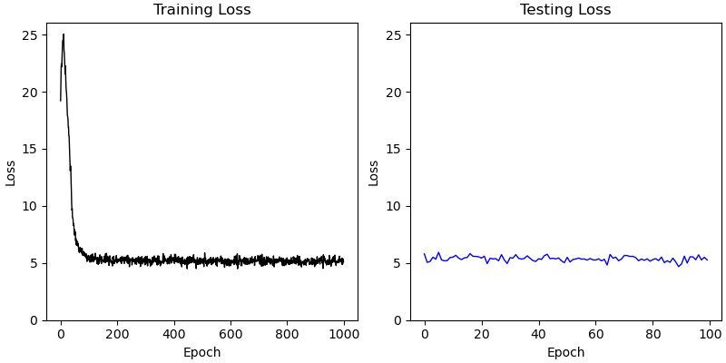
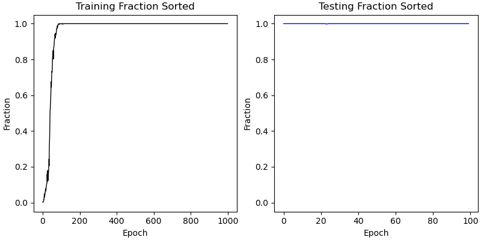

# Documentation: Transformer and Pointer Network Demonstration

This is the first part of a series of experiments on pointer networks. I plan 
to use pointer networks for training a dominoes agent (more on that later),
but in the course of developing my dominoes agent, I've developed some new 
architectures for pointer networks and explore how they work in this series.

Pointer networks are a clever design developed by Vinyals et al. in 
[this](https://papers.nips.cc/paper_files/paper/2015/hash/29921001f2f04bd3baee84a12e98098f-Abstract.html)
paper. Like transformers, their architecture permits a variable input size, in
which each input is a set or tokens, each containing a D-dimensional 
representation of some features. However, pointer networks are powerful 
because they use an attention-based mechanism to generate sequential output 
from a variable length _output set_ (the output set is usually comprised of 
the input tokens). This is why I am using pointer networks for dominoes - they
can generate a sequence of dominoes from a "hand" with variable numbers of 
dominoes in it, which is exactly what an agent needs to do to play dominoes 
well. Additionally, pointer networks can solve complex combinatorial problems
like the traveling salesman problem, which I'll explore in the third part of 
this series. 

In this file, I introduce how pointer networks work, explain how I've varied
the architecture a bit from the original paper, and demonstrate their 
performance on a toy problem in which they have to sort dominoes. The figures
in this file are all generated by a single python script which takes about 5
minutes to run if you have a GPU. To generate the figures yourself, run this
command:

```
python experiments/pointerDemonstration.py
```

## Toy Problem Explanation
The toy problem requires pointer networks to sort dominoes by the value on 
each dominoe given a random set of dominoes in random order. Due to the magic
(engineering) of pointer networks, it can do this on input data with a 
variable set size. Since it's a simple problem, the pointer network learns the
task in just a few minutes. 

As a means of testing whether the network really learns the values of dominoes
rather than just learning a lookup table of inputs to outputs, the training 
set includes only 2/3rds of the possible dominoes, but the testing is done 
with all of them. 

### Input
A full set of dominoes is a set of paired values (combinations with 
replacement) of the integers from 0 to `highestDominoe`. Therefore, the input
to the network is represented as a two-hot tensor stack in which each `1` in 
the tensor represents the values on the dominoe. 

The first `highestDominoe+1` elements represent the first value of the dominoe
and the second `highestDominoe+1` elements represent the second value of the
dominoe. Here are some examples for `highestDominoe = 3`:

(0 | 0): `[1, 0, 0, 0, 1, 0, 0, 0]` &emsp; value: `0`   
(0 | 1): `[1, 0, 0, 0, 0, 1, 0, 0]` &emsp; value: `1`    
(0 | 2): `[1, 0, 0, 0, 0, 0, 1, 0]` &emsp; value: `2`  
(0 | 3): `[1, 0, 0, 0, 0, 0, 0, 1]` &emsp; value: `3`  
(1 | 0): `[0, 1, 0, 0, 1, 0, 0, 0]` &emsp; value: `1`  
(2 | 1): `[0, 0, 1, 0, 0, 1, 0, 0]` &emsp; value: `3`  

Dominoes with non-equal value pairs (e.g. `(1 | 2)`) are represented in the 
dataset in both directions (the `(2 | 1)` representation is included).

### Target
The value of each dominoe is the sum of the two values on the dominoe. For 
example, the dominoe `(1 | 2)` has value `3`. The task of this toy problem is 
to sort dominoes based on their value, from highest to lowest, and output them
in order using a pointer network. Note that some dominoes have equal value in 
a set, but because the dominoes are always initialized in the same order, 
equal value dominoes are always sorted in the same way. 

The target is represented as a list of integers corresponding to the arg sort
of the dominoe values for each hand. As an example, if a hand was composed of 
the 6 dominoes shown above as an example, the target is `[5,3,2,4,1,0]`.

### Network Architecture
The pointer network architecture consists of two stages, an encoder and a 
decoder. The encoder generates an embedding of each element of an input 
sequence, along with a context vector that describes the state of the whole
set of inputs. The decoder first updates the context vector based on the last 
output of the network, then it chooses one of the input elements to output 
next by combining the embedded representations with the context vector.

#### Pointer Network Encoder
In the original paper by Vinyals et al., the encoder is an LSTM RNN. In this
implementation, I have replaced the LSTM with a transfomer. The context vector
is just a sum of the transformed input representations. 



#### Pointer Network Decoder
The decoder stage first updates the context vector. In the original paper, 
this is performed with a second RNN in which the context vector is 
equivalent to the hidden state (or cell state, depending on which RNN is 
used). Here, I replace it with a "multi-context transformer", in which the 
transformer receives some inputs to be transformed and some inputs that are 
purely used for context. Those "context inputs" are used to generate keys and
value but not queries, and so are not transformed. The transformer uses 
distinct matrices to transform the main inputs and context inputs into keys
and values, so it can learn a different code for each kind of input. For more
detail, see the [code](https://github.com/landoskape/dominoes/blob/main/dominoes/transformers.py#L637)
to the multi-context transformer.

Finally, a pointer attention module combines the new context vector with the
encoded representations to choose one of the inputs as the next output. This 
is done however many times is requested. 

As is common in the literature, previously chosen inputs are masked so the 
output is a permutation of the inputs. 



### Training
To train the network, I used the Adam optimizer with $lr=1e^{-3}$ and L2 
regularization with $\lambda=1e^{-5}$.

### Testing
Testing is exactly the same as training, except the remaining 1/3 of dominoe
pairs are returned to the dataset. 

## Results

The main result of the problem is shown here: 


As you can see, the network quickly learns to sort dominoes by their value 
effectively. Pretty cool! The fact that the loss asymptotes to around 5 
is due to the fact that some dominoes have the same value, but the target
expects them to be sorted a consistent way. This loss is just the average loss
expected from the few choices that should be swapped in each batch, and the 
value used to mask the choice in log-softmax (the log-score of a masked option
is close to -100 and the chosen option is usually closer to 0). 

To show that the network performs the task correctly (albeit not knowing how 
to sort equal value dominoes) I also made a plot showing the fraction of 
properly sorted hands throughout training and during testing. 



As you can see, the network quickly learns to sort the dominoes and does it 
almost perfectly in just a few epochs. Since this is just a toy problem for 
illustrating the pointer networks, I'm not invested in fixing the equal-value
sorting issue, so happy to leave it as it is. (I'm also more interested in the
reinforcement learning formulation of the problem, which is more flexible and
doesn't have this preference of sort order). 


